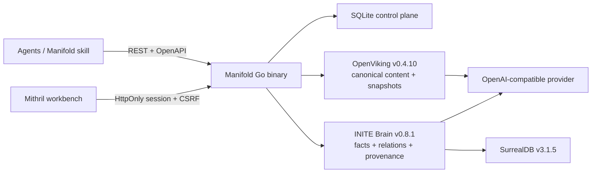

# Manifold

**A self-hosted knowledge and memory layer for AI agents.**

Manifold gives agents one REST API for canonical documents, immutable revisions, search context, structured facts and relations, provenance, conflicts, durable jobs, and explicit cascading renames. It ships as one Go binary with an embedded Mithril workbench and a self-contained agent skill.

Manifold does **not** implement or publish MCP. Its public integration surface is HTTP plus an OpenAPI 3.1 contract.

## What it provides

- Semantic ASCII slugs for human-facing resources; compact XIDs for event-like resources.
- OpenViking-backed canonical folders, documents, content, and snapshots.
- INITE Brain-backed entities, facts, relations, provenance, and conflict extraction.
- A SQLite control plane for public IDs, upstream mappings, jobs, revisions, idempotency, rename plans, API-key hashes, and UI sessions.
- Hybrid retrieval with reciprocal-rank fusion and token-budgeted evidence packs.
- Canonical search hits that expose public slugs, revisions, paths, and `manifold://` references instead of upstream IDs.
- Atomic document creation by nested `folder_path`, plus slash-aware glob browsing across folders and documents.
- Durable document indexing jobs with structured, persisted remediation.
- Preview-first batch rename plans that support swaps and cycles.
- Bearer capabilities, Argon2id key hashes, ETags, idempotency, HttpOnly sessions, and CSRF protection.
- Explorer, Search/Context, Jobs, Graph, Conflicts, Rename Preview, and System screens.

## Install

### Deploy with an agent

Copy the following block to an infrastructure agent that can reach the target server. The agent should stop only for credentials or deployment facts that cannot be discovered safely.

```text
Deploy Manifold, "A self-hosted knowledge and memory layer for AI agents", from
https://github.com/iamwavecut/Manifold on the remote Linux server I provide.
Use the main branch and the repository's Docker Compose deployment.

Before changing the server:
1. Read README.md, AGENTS.md, .env.example, docker-compose.yml, and
   docs/operations.md.
2. Discover the server architecture, Docker/Compose availability, existing
   reverse proxy, public DNS name, TLS status, and any existing Manifold
   installation. Preserve existing volumes and .env files.
3. Ask me only for facts or secrets that are still missing: the public HTTPS
   URL, an OpenAI-compatible base URL/API key, chat model, embedding model and
   dimensions, and server access if it was not already supplied. Do not invent
   credentials or silently use localhost as the public URL.

Deploy:
1. Install Docker Engine with Compose only if it is missing and I authorize
   system package changes.
2. Clone or fast-forward the repository into a stable server path. Never reset
   or delete an existing deployment or its named volumes.
3. On first install, create .env from .env.example. Generate independent,
   cryptographically random values for MANIFOLD_BOOTSTRAP_API_KEY,
   OPENVIKING_API_KEY, BRAIN_API_KEY, FORGET_HMAC_KEY, SURREALDB_PASSWORD, and
   SURREALDB_SCOPED_PASS. Set MANIFOLD_PUBLIC_URL to the externally reachable
   URL and set the supplied OpenAI-compatible provider values.
4. Derive BRAIN_API_KEYS_JSON from BRAIN_API_KEY as documented. Do not require
   Python: use a standard SHA-256 utility or a temporary container. Keep .env
   mode 0600, never commit it, and never print secrets into logs or chat.
5. Run `docker compose --env-file .env config --quiet`, then
   `docker compose up -d --build`. Keep OpenViking, Brain, and SurrealDB on the
   private data network. OpenViking and Brain also need the un-published
   provider network for outbound model API access. Publish only Manifold.
6. Put Manifold behind the server's HTTPS reverse proxy when one is available.
   Do not weaken the firewall or expose dependency ports.

Verify before reporting success:
1. Wait for every Compose healthcheck and inspect failing service logs if a
   service does not become healthy.
2. Verify `/health`, `/ready`, `/openapi.yaml`, and authenticated
   `/api/v1/status` through the public URL.
3. Create one small test document through the REST API with an Idempotency-Key,
   poll its job to a terminal state, read the document, then delete the test
   document. Treat a dependency or provider error as a deployment failure and
   follow its semantic remediation.
4. Restart only the Manifold container and verify the authenticated status
   again to prove SQLite persistence.
5. Confirm with `docker compose ps` that no OpenViking, Brain, or SurrealDB port
   is published.

Return the public Manifold URL, deployed commit, architecture, service health,
verification results, and backup/restore command location. Deliver the
bootstrap API key to me through the safest available private channel exactly
once; do not include any other secret. If any check is skipped or fails, say so
explicitly and do not call the deployment complete.
```

### Manual quick start

Requirements: Docker with Compose and an OpenAI-compatible chat and embedding provider.

```bash
cp .env.example .env
```

Replace every placeholder in `.env`. If `BRAIN_API_KEY` changes, regenerate the matching hash-only Brain registry:

```bash
set -a
source .env
set +a
scripts/brain-key-hash.sh
```

Copy the printed `BRAIN_API_KEYS_JSON=...` line into `.env`, then start the stack:

```bash
docker compose up -d --build
docker compose ps
curl --fail http://localhost:8080/health
```

Only Manifold is published to the host. OpenViking, Brain, and SurrealDB share
an internal data network; OpenViking and Brain also have outbound provider
access on an un-published network.

- Workbench: <http://localhost:8080/app/>
- Interactive API docs: <http://localhost:8080/docs/api>
- OpenAPI YAML: <http://localhost:8080/openapi.yaml>

On the first start, `MANIFOLD_BOOTSTRAP_API_KEY` creates the `bootstrap-admin` record. Manifold stores only its Argon2id hash.
New API-key secrets are shown once and are never stored in idempotency responses.
An exact replay returns `api_key_secret_not_replayable` without creating a
second key; revoke and replace the key if the original response was lost.

## Architecture



SQLite is authoritative for Manifold public identity and workflow state. OpenViking is authoritative for canonical content and snapshots. Brain is authoritative for derived graph knowledge. Upstream IDs remain private opaque mappings and never become Manifold IDs.

One process serves the API and UI and runs the durable worker. Version 1 is intentionally single-tenant, single-replica, and self-hosted.

## REST examples

All mutations require `Idempotency-Key`. Concurrent document changes also require `If-Match`.

```bash
export MANIFOLD_URL=http://localhost:8080
export MANIFOLD_API_KEY='the-bootstrap-secret'

curl "$MANIFOLD_URL/api/v1/folders" \
  -H "Authorization: Bearer $MANIFOLD_API_KEY"

curl -X POST "$MANIFOLD_URL/api/v1/documents" \
  -H "Authorization: Bearer $MANIFOLD_API_KEY" \
  -H "Content-Type: application/json" \
  -H "Idempotency-Key: import-agent-memory-1" \
  -d '{
    "id": "agent-memory",
    "folder_path": "shared/agent-practice",
    "title": "Agent memory",
    "format": "markdown",
    "content": "# Decisions\n\nCanonical evidence lives here."
  }'

curl -X POST "$MANIFOLD_URL/api/v1/context" \
  -H "Authorization: Bearer $MANIFOLD_API_KEY" \
  -H "Content-Type: application/json" \
  -d '{"query":"Where does canonical evidence live?","scope_glob":"shared/**","source_types":["document"],"token_budget":1200}'

curl "$MANIFOLD_URL/api/v1/tree?glob=shared%2F**&types=folder,document" \
  -H "Authorization: Bearer $MANIFOLD_API_KEY"
```

Document mutations return `202 Accepted` with a job XID. Poll `GET /api/v1/jobs/{xid}` until it reaches `ready`, `partially_ready`, or `failed`.
When `folder_path` names missing semantic path segments, the document and all
missing folders are committed atomically. `folder_id` remains available for
callers that already know the direct parent; do not send both selectors.

Search results are canonicalized through SQLite before they leave Manifold.
Internal OpenViking overview resources and unmapped Brain/OpenViking IDs are
discarded; each returned document includes its public `id`, `path`, `revision`,
and immutable `canonical_ref`. `scope_glob` uses `*` and `?` within a segment
and a whole `**` segment for recursive matching.

The generated contract covers:

- health, readiness, status, and metrics;
- folders and a path-bearing tree;
- document creation, batch import, current content, immutable revisions, and deletion;
- durable jobs and retry;
- search and token-budgeted context;
- entities, facts, relations, graph paths, conflicts, and provenance sources;
- cascading rename previews and apply;
- API-key administration and UI sessions.

## Semantic errors

Every API failure is `application/problem+json`. Agents receive a stable `code`, request context, retry safety, field violations, workflow state when applicable, and concrete remediation.

```json
{
  "type": "http://localhost:8080/errors/etag_mismatch",
  "title": "Resource changed",
  "status": 409,
  "detail": "The If-Match value does not describe the current resource revision.",
  "code": "etag_mismatch",
  "request_id": "d5vqh9idc6b5u5sctq00",
  "retryable": false,
  "current_etag": "\"v3\"",
  "remediation": {
    "summary": "Read the current resource, reapply the intended change, and retry with its ETag.",
    "steps": [
      "GET /api/v1/documents/agent-memory.",
      "Merge the intended change into the returned state.",
      "Retry with If-Match: \"v3\"."
    ]
  },
  "documentation_url": "http://localhost:8080/docs/errors/etag_mismatch"
}
```

Public codes and recovery rules are catalogued in [docs/errors.md](docs/errors.md). Raw stack traces, SQL, provider payloads, API keys, and private document content are never part of a problem response. A failed asynchronous job persists the same error shape.

## IDs and cascading rename

| Resource | ID |
| --- | --- |
| folder, document, entity, source, API-key record | semantic slug |
| fact, relation, conflict, job, request, rename plan | XID |
| revision | `r1`, `r2`, … |
| chunk | `document-slug@r3#chunk-7` |

Slugs are transliterated into ASCII kebab-case. Collisions use deterministic `-2`, `-3`, … suffixes. Changing a display name does not change its slug.

Renames are explicit:

1. `POST /api/v1/rename-plans` previews all operations, structured references, text replacements, and blockers.
2. Review the immutable preview.
3. `POST /api/v1/rename-plans/{xid}/apply` applies it only if the state version is unchanged.

The SQLite phase is transactional and supports batches, swaps, and cycles via reserved temporary IDs. Foreign keys cascade. OpenViking folder and document moves use durable two-phase staging, so a restart resumes instead of repeating a completed move. Active UTF-8 documents receive token-bounded replacements in content, titles, metadata, and tags plus a new revision. Historical revisions remain exact audit evidence. Binary blockers stop the plan before apply. Old slugs are immediately reusable; Manifold creates neither aliases nor redirects. A later lookup can report an unambiguous rename-audit destination without redirecting.

## Agent skill

The repository skill lives at [`skills/manifold`](skills/manifold). It connects
to any operator-provided, network-reachable Manifold instance and has no
localhost default.

Install it with the standard [`skills`](https://github.com/vercel-labs/skills)
CLI. The canonical command installs Manifold globally and leaves agent
selection and confirmation to the installer:

```bash
npx skills add iamwavecut/Manifold \
  --skill manifold \
  --global
```

`--global` makes the skill available at user scope. The CLI handles agent
selection and confirmation according to the current environment.

Set `MANIFOLD_URL` to the selected remote instance and set
`MANIFOLD_API_KEY`, then ask an agent to use `$manifold`. The `npx` installation
step requires Node.js/npm. After installation, the skill ships self-contained
native clients for macOS and Linux on `amd64` and `arm64`; using Manifold does
not require Python, Go, Node.js, or another language runtime. The client maps
semantic error codes to stable exit statuses.

The skill treats Manifold as first-class memory. It searches and reads before
creation, requires new knowledge to have a nested destination, stops on related
candidates until the agent chooses an update or explicitly justified new
document, and waits for the indexing job to reach `ready`. A key used by
`remember` needs `search`, `read_documents`, and `write_documents`.

```bash
sh scripts/manifold search --type document "retention decision"
sh scripts/manifold tree --glob 'shared/**'
sh scripts/manifold remember \
  --id retention-policy \
  --title "Retention policy" \
  --folder-path shared/operations \
  --file retention-policy.md
```

Use `shared/<domain>` for durable cross-agent knowledge,
`projects/<project>/<project-qualified-topic>` for durable project knowledge,
and a distinct `tasks/<task-slug>` folder for isolated work. Reuse a matching
existing hierarchy instead of creating equivalent branches or a catch-all
folder.

See [docs/skill.md](docs/skill.md) for project/global installation, updates,
removal, verification, secure instance targeting, and multiple-instance
profiles.

## Development

Go 1.26 and Node 26 are the supported local toolchains.

```bash
npm ci
make test
make web-check
make openapi
make openapi-check
make skill-check
make verify
```

`api/openapi.yaml` is generated from Huma registrations and checked for drift. `make verify` runs unit/API/contract tests, the race detector, vet, UI typechecking/build, OpenAPI drift, and skill tests.

Run the deterministic full-stack suite, including a Manifold restart and persistence check:

```bash
make integration
```

It starts an isolated `manifold-integration` Compose project with a repository-owned OpenAI-compatible test provider and removes only that project's volumes when finished. It does not validate a production provider.

Native container images are built for `linux/amd64` and `linux/arm64`. See [docs/operations.md](docs/operations.md) for backup, restore, and recovery.

## Built on

Manifold is an integration layer built on the original projects:

- [OpenViking](https://github.com/volcengine/OpenViking) v0.4.10
- [INITE Brain](https://github.com/inite-ai/inite-brain-service) v0.8.1
- [SurrealDB](https://github.com/surrealdb/surrealdb)
- [Huma](https://github.com/danielgtaylor/huma)
- [Mithril.js](https://github.com/MithrilJS/mithril.js)

See [THIRD_PARTY_NOTICES.md](THIRD_PARTY_NOTICES.md) and [docs/brain-patch.md](docs/brain-patch.md) for version, license, and patch details.

## License

Manifold is licensed under `AGPL-3.0-or-later`. See [LICENSE](LICENSE).
