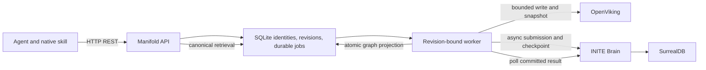

# Manifold architecture review — 2026-09-16

Reviewed baseline: `527273a001e3189f4730b73f072f7cfa4cc3b72c` (v0.2.2).
Implementation is on the isolated `manifold-refresh` branch. This report
distinguishes a bounded production observation from local verification; it is
not a deployment record.

## Findings, ordered by impact

1. **P1 — completed extraction was not materialized into the public graph.**
   The baseline worker consumed only `ingest.DocumentID` and discarded
   `EntityIDs`, `FactIDs` and `EdgeIDs`, while graph APIs read SQLite mappings.
   A ready document therefore did not imply a usable structured memory graph.
   Evidence: baseline `internal/service/service.go:615-622` and
   `internal/upstream/brain.go:49-64`. The September 16 read-only production
   snapshot counted zero public entities, facts and relations; this does not
   prove that Brain's private graph was empty. The repair projects typed,
   committed Brain results into stable public identities with exact document
   revision provenance.

2. **P1 — jobs were not bound to their requested revision.**
   `syncDocument` fetched the latest document, and unguarded status/snapshot
   updates could attach an older job's result to a newer revision. Failure
   before extraction left documents `accepted` even after the job failed;
   retry could lose the distinction between failed and partially indexed.
   Several job-state persistence errors were ignored. Evidence: baseline
   `internal/service/service.go:537-557,562-622`. The repair binds each job to
   a revision, guards transitions and checkpoints, reconciles legacy jobs only
   when their original timestamp uniquely identifies a revision, preserves
   resumable state and propagates persistence failures.

3. **P1 — interactive timeouts interrupted durable model work.**
   OpenViking `wait:true` writes shared the 30-second client used for probes
   and search (`cmd/manifold/main.go:73-76`). A September 8 production write
   failed after exactly 30 seconds. A September 2 Brain extraction reached
   the two-minute request deadline; upstream cancellation then aborted work.
   The repair separates OpenViking write deadlines and uses asynchronous
   Brain submission plus durable polling. Brain text-only deduplication also
   needed an origin-identity patch so equal text in distinct Manifold document
   revisions cannot collapse into one provenance source.

4. **P1 — dependency upgrades made automatic code-only rollback unsafe.**
   The previous deployment script rebuilt the old checkout after any smoke
   failure while keeping newly opened data volumes. Brain v2 runs additional
   schema migrations, so old code cannot be assumed compatible with those
   volumes. `DATA_VERSION` now blocks cross-version automatic activation
   before checkout/runtime changes. The coordinated backup, migration and
   full-data rollback procedure is in [operations.md](operations.md).

5. **P1 — Brain could start polling before document handlers existed.**
   A repeated fresh v2.2.0 integration boot acquired the worker lease at
   10:19:54 UTC and started only two early handlers. The document index/commit
   handlers registered four seconds later, after `loopsStarted` was set, and
   never received polling loops. Both synthetic index jobs stayed pending at
   attempt zero despite healthy probes. Upstream `WorkerLoopService` started
   a fixed five-second timer in `onModuleInit`; startup duration exceeded it.
   The downstream startup-order repair starts the scheduler only after module
   initialization has completed. It is covered by a delayed-registration
   regression and the final fresh-stack integration run.

6. **P2 — agents confused absent connector tools with an unavailable service.**
   Three inspected September 15–16 agent sessions stopped after empty tool
   discovery without reading the installed skill or calling Manifold. Live
   CLI status, context and canonical reads succeeded in this investigation.
   Manifold is a REST/OpenAPI service with a native CLI skill; it has no public
   MCP or gRPC server. The global instruction, repository skill and installed
   skill now state the route, executable discovery and evidence required to
   report a real failure.

7. **P2 — transport success and health were insufficient success criteria.**
   OpenViking v0.4.20 can return HTTP 200 with failed semantic/vector queues.
   Its adapter now requires completed/skipped index stages. Component probes
   remain separate from current document pipeline status, and the skill
   distinguishes a local wait timeout from a terminal server failure. The
   production snapshot contained 133 historical jobs (53 ready, 58 failed,
   22 partially ready) and 21 current documents (9 ready, 9 accepted,
   3 partially ready), with no active jobs. These historical counts alone do
   not establish that current retrieval is broken.

8. **P2 — the deterministic integration provider could prove an empty graph.**
   Its generic structured-output fixture filled extraction arrays with empty
   lists. Healthy dependencies and ready document jobs therefore passed
   without extracting knowledge. A grounded synthetic fixture now produces a
   person, an organization, a fact and a relation. The full-stack regression
   checks creation, canonical graph search, source revisions, replacement of
   current evidence and deletion.

9. **P2 — revision responses exposed a private storage checkpoint.**
   Baseline `internal/model/model.go:46` serialized `snapshot_oid`. The field
   remains persisted for recovery and immutable history but is now omitted
   from REST/OpenAPI, matching the existing private `ov_uri`/`brain_id`
   boundary. Revision content and public revision references remain available;
   an API regression checks both authorized and unauthorized reads.

10. **P2 — the OpenAPI drift check could exit successfully after a mismatch.**
   The Make recipe ended with temporary-file removal, hiding a failed `diff`
   or generator. It now preserves failure and cleans up through an exit trap.
   A controlled fixture verified both rejection of drift and acceptance of an
   exact match; the final generated contract is checked by `make verify`.

## Target architecture and boundaries

SQLite remains the public identity and workflow authority. OpenViking owns
canonical storage/indexing/snapshots. Brain owns extraction and graph semantics;
Manifold projects its committed result, without introducing a second inference
engine. Public slugs/XIDs and immutable `manifold://` references remain stable.
Internal Brain IDs, provider payloads and credentials stay out of public
responses. Current retrieval must exclude deleted or superseded source claims.
One tenant and one Manifold replica remain the deployment boundary.

## Scope of the Brain upgrade

The pinned [Brain v2.2.0 release](https://github.com/inite-ai/inite-brain-service/releases/tag/v2.2.0)
adds major evidence, belief, temporal and multilingual capabilities. Manifold
integrates the document run/candidate lifecycle, committed entity/fact/relation
reads and canonical provenance needed for its existing public memory contract.
The exact source revision and required downstream patches are documented in
[brain-patch.md](brain-patch.md).

Belief serving, multimodal ingestion, autonomous trajectory memory, domain-pack
activation and embedding-space migration are not implicitly enabled by this
dependency refresh. Those features require explicit public data semantics,
consent/scope decisions and representative evaluation before integration. The
existing provider and embedding dimensions are preserved.

The accompanying [OpenViking v0.4.20 release](https://github.com/volcengine/OpenViking/releases/tag/v0.4.20)
requires a syntactically valid JSON configuration template because its Rust
storage binding reads the file before Python expands environment variables.
The quoted dimension placeholder is still coerced to the configured integer.
Snapshot identifiers are preserved byte-for-byte.

## Remaining architecture limits

The document pipeline is the durable path for agent memory. The pre-existing
explicit `CreateFact` and `CreateRelation` APIs still treat SQLite as the
immediate result and perform best-effort Brain replication. A provider failure
there does not enqueue a retry; the API can return a local record that is absent
from Brain retrieval (`internal/service/service.go`, `CreateFact` and
`CreateRelation`). A durable outbox for those manual graph writes remains a P2
follow-up and is not claimed as repaired by the document extraction changes.

The generic job-retry endpoint still accepts a failed job whose semantic error
has `retryable: false`. A terminally rolled-back rename plan cannot resume this
way; its remediation requires a fresh reviewed plan. The CLI instruction follows
that remediation, but a server-side rejection is a separate API-hardening item.

The existing conflict API remains available for explicitly authored local
facts. This upgrade does not project Brain's belief or conflict lifecycle into
that API. Automatically treating every different predicate value as a conflict
would misrepresent multi-valued knowledge, so derived projection delegates
graph semantics to Brain and adds no local conflict inference.

## Verification and rollout status

Local unit, race, API/contract, UI, skill, container and deterministic integration
checks are recorded in [the implementation plan](../plans/004-memory-pipeline-refresh.md).
The initial local implementation passed these checks, including full extraction
and recovery on the five-patch Brain image. The subsequent explicitly authorized
production migration is recorded in [deployment verification](deployment-verification.md).
Its acceptance tests exposed two additional integration gaps: corroborating
fact candidates referenced hidden audit records, and reused relations were
filtered by their original source instead of their current committed candidate.
The sixth Brain patch and adapter correction preserve serving identities and
current revision provenance. A same-content update regression reproduces both
cases and passes in the complete integration suite. Brain's separate provider
deadline is also configured explicitly after real requests exceeded its
30-second default. Existing ready documents require a reviewed backfill; merely
starting the upgraded stack does not re-extract them.

The existing-document acceptance also exposed a false-success path: Brain
limited extraction output to 1,500 tokens, then treated truncated JSON as a
successful empty graph. The seventh patch validates completion and response
shape, raises the configurable output budget, and propagates extraction
failures into the durable run ledger. Explicit valid empty results remain
valid. Private hydration rate limits and the outer extraction deadline are
configured for document-sized batches. See the deployment report for actual
backfill acceptance; component health alone does not establish success.
